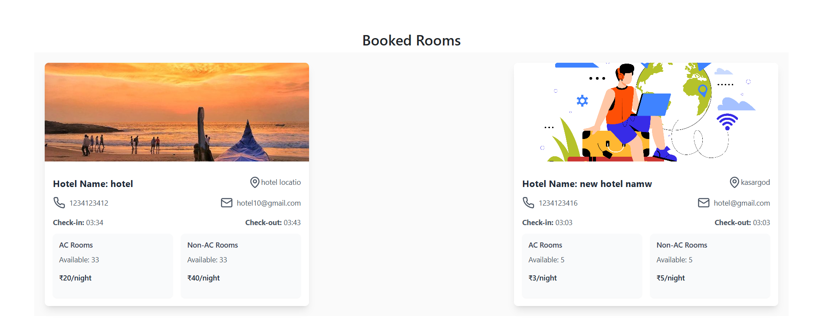
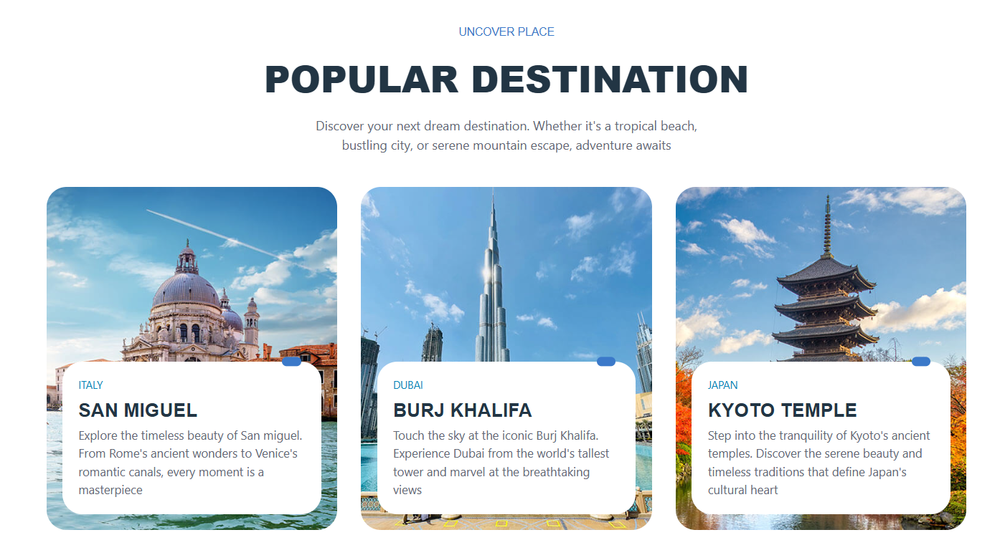

# All-in-One Travel Guide


Welcome to the **All-in-One Travel Guide**, a comprehensive platform to streamline your travel planning experience. This web-based application centralizes all travel-related information, making it easier to plan trips, compare options, and make bookings efficiently.

## 🌟 Features

### User Features
- **Search and Book**:
  - Hotels
  - Transportation
  - Travel Packages
- **Reviews and Ratings**: Access and contribute user reviews for better decision-making.
- **Explore Nearby Attractions**: Discover tourist spots and activities close to your location.
- **Personalized Dashboard**: View and manage your bookings conveniently.

### Service Provider Features
- **Hotels**:
  - Register and manage rooms
  - View and handle booking requests.
- **Taxi Services**:
  - Register vehicles .
  - Approve or reject ride requests.
- **Travel Agencies**:
  - Add and manage travel packages.
  - View bookings and customer interactions.

### Admin Features
- Manage platform data:
  - Add and update tourism details.
  - Oversee hotel, and taxi listings.
  - Monitor and manage user reviews.
- Analytics Dashboard: Gain insights into platform usage and performance.

## 🛠️ Technologies Used

- **Frontend**: React.js, HTML, CSS, Bootstrap
- **Backend**: Node.js, Express.js
- **Database**: MongoDB
- **Tools**: Visual Studio Code

## 📷 Project Visuals

### 1. Homepage


### 2. Request Taxi


### 3. Booked Rooms


### 3. Popular destinations


## 📖 How to Run the Project

1. **Clone the Repository**:
   ```bash
   git clone https://github.com/AnandRP2030/Travel-guide.git
   cd all-in-one-travel-guide
   ```

2. **Install Dependencies**:
   ```bash
   cd client && npm install
   ```

3. **Start the Server**:
   ```bash
   npm start
   ```

